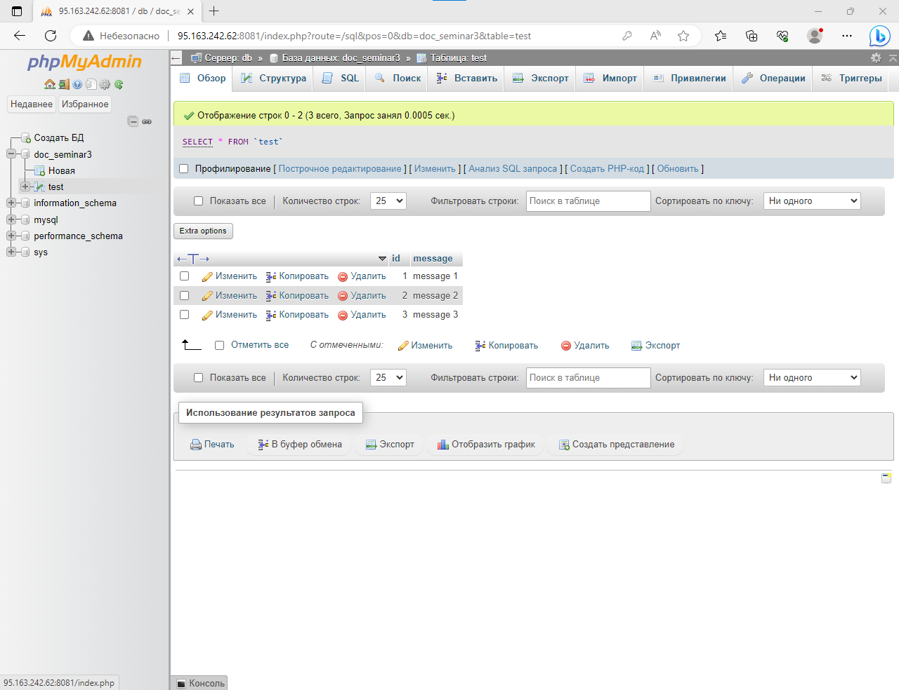

# Создадим на хосте файл test.txt и наполним его данными.
    root@95-163-242-62:~# mkdir -p seminar3/test
    root@95-163-242-62:~# echo "Hello from Host!" > seminar3/test/test.txt
# Свяжем папку test на хосте с папкой otherway в контейнере и проверим, что test.txt доступен из контейнера.
    root@95-163-242-62:~# docker run -it -h GB --name gb-test -v /root/seminar3/test:/otherway ubuntu:22.04
    root@GB:/# cat /otherway/test.txt
    Hello from Host!
# Изменим файл test.txt в контейнере и убедимся, что измения также произошли в файле test.txt на хосте.
    root@GB:/# echo "Hello from Docker!" > /otherway/test.txt
    root@GB:/# exit
    exit
    root@95-163-242-62:~# cat  seminar3/test/test.txt
    Hello from Docker!
# Запустим контейнер с БД MySQL и подключимся к серверу mysql.
    root@95-163-242-62:~# docker run --name some-mysql -e MYSQL_ROOT_PASSWORD=my-secret-pw -d mysql
    fe0b5ce3b9866f7b754bec5760e658d39749e5097d6e69a3ff30e961b749ba68
    root@95-163-242-62:~# docker exec -it some-mysql bash
    bash-4.4# mysql -p
    Enter password:
    Welcome to the MySQL monitor.  Commands end with ; or \g.
    Your MySQL connection id is 9
    Server version: 8.0.33 MySQL Community Server - GPL

    Copyright (c) 2000, 2023, Oracle and/or its affiliates.

    Oracle is a registered trademark of Oracle Corporation and/or its
    affiliates. Other names may be trademarks of their respective
    owners.

    Type 'help;' or '\h' for help. Type '\c' to clear the current input statement.
# Создадим таблицу test и заполним ее данными.
    mysql> CREATE DATABASE doc_seminar3;
    Query OK, 1 row affected (0.02 sec)

    mysql> USE doc_seminar3;
    Database changed
    mysql> CREATE TABLE test (id SERIAL PRIMARY KEY, message VARCHAR(100));
    Query OK, 0 rows affected (0.03 sec)

    mysql> INSERT INTO test (message) VALUES ('message 1'),('message 2'),('message 3');
    Query OK, 3 rows affected (0.06 sec)
    Records: 3  Duplicates: 0  Warnings: 0

    mysql> exit
    Bye
    bash-4.4# exit
    exit
# Запустим phpmyadmin в контейнере и проверим через веб доступность данных.
    root@95-163-242-62:~# docker run --name myphp -d --link some-mysql:db -p 8081:80 phpmyadmin/phpmyadmin
    f73dcd8dbb48ff66e09d9484162cc22476e167cee4a0f95f89cc71f90953fb3f
